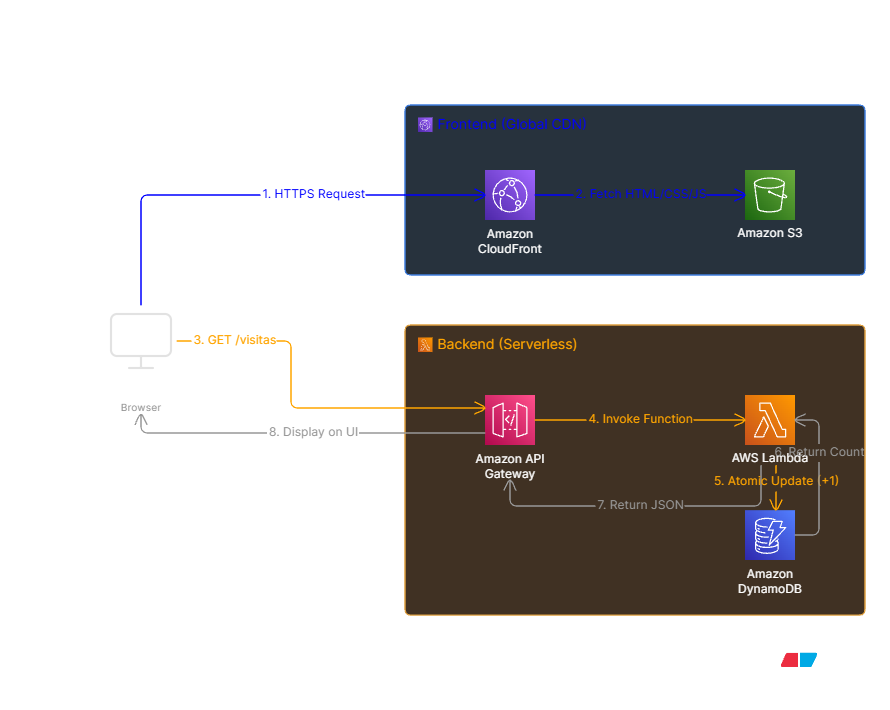

# ☁️ The Cloud Resume Challenge - AWS Architecture

## 📌 Visión General
Este repositorio contiene el código fuente y la documentación de la infraestructura para mi implementación del [Cloud Resume Challenge](https://cloudresumechallenge.dev/). 

El proyecto consiste en el despliegue de un currículum interactivo completo (Frontend y Backend) utilizando una arquitectura **100% Serverless** en Amazon Web Services (AWS), garantizando alta disponibilidad, seguridad y escalabilidad a un coste operativo mínimo.

🔗 https://d1b7kkho5ijjl6.cloudfront.net/

## 🏗️ Arquitectura del Sistema

### Stack Tecnológico y Servicios AWS

#### 🖥️ Capa Frontend (Distribución Global)
*   **Amazon S3:** Alojamiento estático de los recursos web (HTML, CSS, JS, imágenes, PDF). Configurado con acceso público bloqueado por defecto por seguridad.
*   **Amazon CloudFront:** Red de Distribución de Contenido (CDN) global. Sirve el contenido de S3 con latencia ultrabaja y fuerza la encriptación HTTPS. Se comunica con S3 mediante OAC (Origin Access Control).

#### ⚙️ Capa Backend (Lógica Serverless)
*   **Amazon API Gateway:** Actúa como punto de entrada (puerta frontal) HTTP/REST, gestionando el enrutamiento seguro de las peticiones `GET /visitas` desde el navegador hacia el entorno computacional.
*   **AWS Lambda (Python 3.12):** Función sin servidor que contiene la lógica de negocio. Se invoca bajo demanda para interactuar con la base de datos, procesar el nuevo conteo de visitantes y devolver la respuesta en formato JSON.
*   **Amazon DynamoDB:** Base de datos NoSQL de esquema flexible y latencia de un dígito de milisegundo. Almacena de forma persistente el registro del contador de visitas.

#### 🛡️ Capa de Seguridad y Red
*   **AWS IAM (Identity and Access Management):** Implementación del principio de "Privilegio Mínimo" mediante roles de ejecución para que la función Lambda solo pueda interactuar con los recursos necesarios.
*   **CORS (Cross-Origin Resource Sharing):** Políticas estrictas configuradas en API Gateway para permitir que únicamente el dominio del portfolio pueda consumir la API del contador.

---

## 📂 Estructura del Repositorio

\`\`\`text
cloud-resume-challenge/
├── frontend/
│   ├── index.html           # Estructura principal y lógica del lado del cliente (Fetch API)
│   └── assets/              # Recursos estáticos
│       ├── mi-cv.pdf
│       └── perfil.jpeg
├── backend/
│   └── lambda_function.py   # Lógica de actualización atómica en DynamoDB
└── README.md
\`\`\`

---

## 🧠 Desafíos Técnicos y Lecciones Aprendidas

Durante el desarrollo de esta arquitectura de grado de producción, me enfrenté y resolví varios retos técnicos clave:

1.  **Gestión del Estado de la Caché (CloudFront):**
    *   *Desafío:* Las actualizaciones en el frontend no se reflejaban inmediatamente en producción debido a las políticas de retención en el Edge de CloudFront.
    *   *Solución:* Implementación de invalidaciones de caché manuales (`/*`) en CloudFront para forzar la actualización de los objetos almacenados en los Edge Locations tras cada despliegue a S3.

2.  **Operaciones Atómicas en Bases de Datos NoSQL:**
    *   *Desafío:* Evitar condiciones de carrera (Race Conditions) si varios usuarios visitan el portfolio simultáneamente, lo que podría corromper el número total de visitas.
    *   *Solución:* Utilización de `UpdateExpression='ADD cantidad :inc'` en la librería `boto3` (Python) para delegar la suma a DynamoDB, garantizando actualizaciones atómicas y thread-safe.

3.  **Seguridad Perimetral (CORS):**
    *   *Desafío:* Los navegadores modernos bloqueaban las peticiones asíncronas del frontend (CloudFront) hacia el backend (API Gateway) por tratarse de orígenes distintos.
    *   *Solución:* Configuración meticulosa de las cabeceras `Access-Control-Allow-Origin` y métodos `OPTIONS` (Preflight requests) tanto en el entorno de API Gateway como en la respuesta directa de la función Lambda.

4.  **Políticas de Seguridad en la Nube (AWS IAM):**
    *   *Desafío:* La función Lambda fallaba al inicio por falta de permisos (Access Denied).
    *   *Solución:* Configuración de Roles de Ejecución en IAM para asociar políticas específicas (`AmazonDynamoDBFullAccess`) al entorno de la Lambda, permitiendo la comunicación fluida pero auditada entre los microservicios.

---

## 🚀 Próximos Pasos (Roadmap)

Actualmente, el proyecto se ha desplegado utilizando metodologías manuales (ClickOps) a través de la consola de AWS para interiorizar el comportamiento de cada servicio. 

Las siguientes iteraciones del proyecto se enfocarán en la excelencia operativa:
*   [ ] **Infraestructura como Código (IaC):** Migración de toda la topología de recursos utilizando **Terraform** / AWS SAM para un despliegue reproducible y versionado.
*   [ ] **CI/CD Pipeline:** Integración de **GitHub Actions** para automatizar los tests de Python, la subida de recursos a S3 y las invalidaciones de CloudFront con cada `git push`.
*   [ ] **DNS y Certificados SSL:** Configuración de un dominio personalizado utilizando **Amazon Route 53** y aprovisionamiento de un certificado SSL/TLS gratuito con **AWS Certificate Manager (ACM)**.
